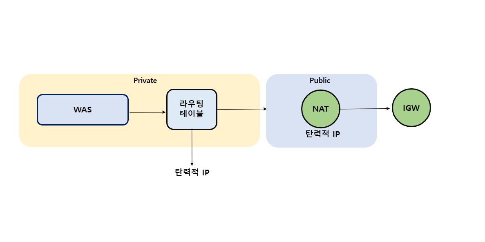

# COKO

*프로젝트를 설명하기에 앞서 해당 README는 제가 프로젝트에 기여한 부분을 중점적으로 작성되었다는 사실을 알려드립니다.*

### COKO(CORONA-KOREA)는 공공 데이터 포털과 서울시 데이터 포털의 코로나 API, 네이버 뉴스 API를 활용하여 코로나 현황을 게시하는 웹 대시보드 서비스입니다.

 

## 1. 제작 기간 & 참여 인원 
- 2022년 11월 14일 - 12월 16일
- 김정현([xc7230](https://github.com/xc7230))
- 이창민([AiLEE96](https://github.com/AiLEE96))
- 백재열([jaeyeol2](https://github.com/jaeyeol2))

 

## 2. 기술 스택
#### `Back-end`
- Python3
- MySQL
- Linux
#### `front-end`
- django
#### `Infra`
- AWS
- Jenkins

## 3. 인프라 설계 및 기능
📌 COKO의 인프라 설계는 API, 3TIER, CI/CD 3가지로 나눌 수 있습니다.

<b>인프라 설계 설명 펼치기</b>

### 3.1. 전체 인프라

<b>상세 설명 펼치기</b>

 

*현재 비용 문제로 운영되지 않고 있습니다.*

 

- **VPC**
    - 모든 인스턴스는 동일 VPC에 존재합니다.

- **IGW**
    - 단일 IGW(Internet Gate Way)로 설정되어 있습니다.

- **Subnet**
    - Public(API, Jenkins, WEB), Private(WAS, RDS) 두 가지 타입이 존재합니다. 

- **NAT gateway**
    - 퍼블릭 서브넷에 존재하며 탄력적 IP가 부여, WAS가 외부와 통신하기 위해서 프라이빗 서브넷 라우팅 테이블에 등록되어있습니다.

- **Autoscaling**
    - 각가 WEB, WAS라는 오토스케일링 그룹이 존재합니다. 리소스 트리거가 설정되어 있어 기준치를 초과시 최대 +2/-2 스케일 아웃/인 설정이 이뤄집니다. 

- **EC2**
    - t2.micro, t3.medium(WAS, Jenkins)

- **RDS**
    - RDS는 MySQL5.7을 사용, 다중 AZ 배포 설정이 이루어져 있습니다.

- **Route 53 && ACM**    
    - corona-korea.com 도메인이 등록되었으며 등록 된 도메인으로 SSL/TLS 인증서가 존재합니다. 

- **ELB**
    - ALB, NLB 두가지 타입이 존재하며 인증서를 사용하기 위해서 HTTPS로 트래픽을 전달합니다. 따라서 HTTP(80) 리스너가 HTTPS(443)으로 리디렉션 됩니다.

- **S3**
    - 배포 될 파일 및 이미지가 젠킨스에 의해서 저장(.ZIP)됩니다.

- **Code Deploy**
    - S3에 업로드 된 파일을 Autoscaling group에 자동 배포합니다.

- **Clout watch**
    - CPU, Memory 사용량을 모니터링하고 기준치를 초과하면 메일로 알람을 보냅니다.

 

### 3-2. API 흐름

- **API 호출**
    - 크론잡에 등록 된 3개의 파일(korea, naver_news.py, seoul)이 매일 12시를 기준으로 자동 실행, 최신화가 이뤄집니다(일요일은 미집계로 제외). 각 파일들은 발급받은 키를 통해서 API를 호출하고 전처리 후 데이터를 RDS에 저장합니다. 이후 데이터 갱신로그를 서버에 저장합니다.

### 3-3. 데이터 전처리     

- **데이터 전처리**
    - naver_news.py는 '코로나 확진자'라는 키워드가 들어간 뉴스를 10개 단위로 출력해서 테이블을 만들어 저장합니다. 📌[전체 코드 확인](https://github.com/AiLEE96/COKO/blob/main/COKO-DASHBOARD/data/naver_news.py)

    - korea.py는 대한민국의 도 별 코로나 확진자 현황 테이블을 만들어 저장합니다. 데이터가 xml 형태로 주어졌기 때문에 xmltodict를 통해서 dict 형태로 파싱, 파싱 된 데이터를 pandas dataframe으로 변환합니다. 📌[전체 코드 확인](https://github.com/AiLEE96/COKO/blob/main/COKO-DASHBOARD/data/korea.py)

    - seoul.py는 서울시의 코로나 확진자 현황 테이블을 만들어 저장합니다. 데이터가 xml 형태로 주어졌기 때문에 xmltodict를 통해서 dict 형태로 파싱, 파싱 된 데이터를 pandas dataframe으로 변환합니다.📌[전체 코드 확인](https://github.com/AiLEE96/COKO/blob/main/COKO-DASHBOARD/data/seoul.py)  

### 3-4. 사용자 요청(3Tier)

- **Route53**
    - Route53에 등록 된 URL 입력 시 사용자의 트래픽은 ALB로 전달 됩니다.

    - 등록 된 도메인은 SSL/TLS 인증서 적용을 위해 해당 도메인의 A record에 ALB의 주소가 저장되어 있습니다. 

- **ALB(Application Load Balancer)**
    - HTTP(80), HTTPS(443)포트가 허용, 인증서 사용을 위해서 사용자의 트래픽이 HTTP -> HTTPS 리디렉션 설정이 이뤄집니다.
    
    - 이후 public subnet에 존재하는 EC2로 트래픽이 분산, ALB와 EC2는 통신 간에 HTTP 프로토콜을 사용합니다.

- **WEB**
    - 사용자는 웹 단에서 화면 구성에 필요한 정적인 파일을 전달 받습니다.(html, css)

    - WEB과 WAS는 Nginx와 Gunicorn으로 연동, 코로나 현황 및 뉴스 데이터와 같은 동적인 정보는 WAS로부터 전달됩니다.

- **NLB(Network Load Balancer)**
    - TCP/IP 프로토콜을 사용, WAS로 요청을 분산합니다.

- **WAS** 📌[전체 코드 확인](https://github.com/AiLEE96/COKO-Dashboard/blob/main/COKO-DASHBOARD/board/views.py)  

    - 사용자 요청에 따라 Corona.objects의 데이터를 조회, 화면 단에서 출력하여 보여줄 내용을 정렬하고 index.html 파일에 적용하여 리턴합니다.

    - 사용자 요청에 따라 News.objects의 데이터를 조회, 화면 단에서 출력하여 보여줄 내용을 정렬하고 news.html 파일에 적용하여 리턴합니다.

### 3-5. CI/CD

- **Github**
    - Frontend, Backend 두 개의 Branch가 존재합니다. 

- **Jenkins**
    - 깃허브에 파일이 업로드 되면 웹훅을 통해서 젠킨스로 이벤트를 전달합니다. Jenkins에는 WEB, WAS 두개의 프로젝트가 존재합니다. Frontend에 업로드 된 파일은 WEB-Project로 Backend에 업로드 된 파일은 WAS로 전달 됩니다. 이후 빌드와 테스트 과정을 거쳐서 파일들은 ZIP형태로 S3에 전달됩니다.

- **S3**
    - WEB, WAS 두개의 폴더가 존재합니다.

- **Code Deploy**
    - 젠킨스로부터 S3에 배포되어 있는 압축 파일을 배포 요청받게 되고 Code Deploy는 젠킨스의 요청에 따라서 WEB, WAS가 속해있는 오토스케일링 그룹으로 배포를 진행합니다.

- **배포 이동 경로**
    - Frontend(Github Branch) - WEB-Project(Jenkins) - WEB-directory(S3) - WEB-Autoscailing Group(Code deploy)

    - Backend(Github Branch) - WAS-Project(Jenkins) - WAS-directory(S3) - WAS-Autoscailing Group(Code deploy)

 

## 4. 핵심 트러블슈팅

### 4.1 젠킨스 인스턴스 배포 실패로 인한 Code Deploy 사용

- 개발 툴에서 빌드 및 푸시가 이뤄지는 순간 각 서버에 배포가 될 수 있게 파이프라인을 구성하고 이러한 일련의 과정을 자동화 시키는게 핵심 목표였습니다.

- 그러나 서버에 배포는 성공적으로 이뤄졌으나 오토스케일링 그룹 트리거를 통해서 새롭게 생성된 서버에는 배포가 이뤄지지 않았습니다.

- 해당 문제는 스케일 OUT된 새로운 인스턴스에 아이피가 매번 IN/OUT 이뤄질때마다 바뀌어서 발생하는 문제였습니다. 매 번 새롭게 생성된 인스턴스의 아이피를 등록하고 파이프라인을 추가하는 일을 자동화라 말할 순 없었습니다.

- 따라서 젠킨스만 사용하는 방법이 아닌 새로운 방법을 모색하게 됐고 오토스케일링 그룹에 속해있는 모든 EC2에 배포가 가능한 Code Deploy의 존재를 알게됐고 이를 활용하기로 했습니다.

- 깃허브의 Front-end, Back-end 브랜치는 젠킨스의 WEB-Project, WAS-Project로 Web-hook trigger 설정이 이뤄지게 생성 됐고 Code deploy plugin을 추가했습니다. 각 프로젝트별로 빌드 및 테스트가 이뤄지고 각 프로젝트 명칭을 딴 S3폴더의 파일이 업로드 됩니다. 이후 Code Deploy는 젠킨스의 요청에 부합하는 Autoscailing group에 배포를 진행하게 됩니다.

- 변경전 : Jenkins - pipline WEB, pipline WAS 배포  
변경후 : Jenkins(WEB, WAS freestyle project) - S3 - Code Deploy - AutoScaling group WEB, WAS 배포.

## 5. 그 외 트러블슈팅

<b> 파이썬 버전 불일치  </b>

- 윈도우 환경에서 테스트 진행 시 설치 된 파이썬과 pip의 버전은 3.9, 리눅스 환경에서 파이썬과 pip 설치 시 default로 설정 된 값은 3.6. 버전 업데이트 후 문제를 해결.  

- apt install python3.9 -y  
update-alternatives --install /usr/bin/python python /usr/bin/python3.9 0   apt -y install software-properties-common git python3.9 python3.9-distutils  
curl https://bootstrap.pypa.io/get-pip.py -o get-pip.py  
python3.9 /apps/get-pip.py

<b> 리눅스 requirements.txt 설치 시 mysqlclient 설치 실패   </b>

- 윈도우 환경에서 버전 명시가 필요 없었지만 리눅스 환경에선 버전 명시가 필요.

- mysqlclient==2.1.1

<b> CodeDeploy agent was not able to receive the lifecycle event.</b>

- 전체 에러 메시지 : CodeDeploy agent was not able to receive the lifecycle event. Check the CodeDeploy agent logs on your host and make sure the agent is running and can connect to the CodeDeploy server.

- 인스턴스가 새롭게 생성(Scale out)됐을 때 Agent가 실행되지 않아서 발생되는 문제. 

- User Data에 최초 실행 될 때 Agent 실행 명령어 삽입.  sudo service codedeploy-agent restart

<b> jenkins 서버 강제 중지 </b>

- 젠킨스의 권장 사양 미달로 인해 발생한 문제, 기존에 사용했던 사양은 t2.micro(1 core, 1 gb)로 플러그인의 개수가 늘어날 때 마다 버벅이다 강제 중지가 되는 현상 발생.

- 플러그인의 설치를 최소화, 2 core, 2 gb로 업그레이해서 문제 해결. 

<b>  jenkins do not deploy </b>

- 갑자기 배포가 안되는 문제가 발생, 원인은 젠킨스 프로젝트 옵션에서 제공하는 "Do not deploy"가 체크되어 있었다. 체크 해제로 문제 해결.

<b> The CodeDeploy agent did not find an  AppSpec file within the unpacked </b>

- AppSpec.yml이 아닌 AppSpec.yaml로 저장해서 발생한 문제.

- 이름을 AppSpec.yml로 변경

<b>  동일 파일 재배포시 실패 오류 "The deployment failed because a specified file already exists at this location" </b>

- 배포 할 서버에 동일한 명칭의 파일이 존재해서 발생하는 문제, 스크립트에 삭제 및 재시작 문구 추가.

- if [ -d /COKO/config ]; then
    sudo rm -rf /COKO/config
fi
sudo mkdir -vp /COKO/config

<b> 배포 수명주기 이벤트 대기시간 속도 개선 1 </b>

- AllowTraffic, BlockTraffic Event에서 속도 저하 및 긴 대기시간이 발생, 디폴트 값을 수정하여 속도를 향샹 시킬 필요성을 느끼게 됐다. AllowTraffic은 Healthy 검사 간격, BlockTraffic은 delay 시간을 감소시켜서 속도를 개선했다.

- Healthy threshold : 4 / interval : 10
- Deregistration delay : 10

<b> 배포 수명주기 이벤트 대기시간 속도 개선 2 </b>

- 배포가 실패 할 경우 디폴트 값으로 설정되어 있는 30분의 시간을 채워서 기다리는 일이 종종 생겼다. 초기에 배포 작업이 오래 걸린다고 생각했으나 긴 기다림 끝에 받아 본 결과는 실패였다. 따라서 확실히 대기시간을 줄여야겠다고 판단, Appspec.yml에서 스크립트가 실핼되는 수명주기에 명령어를 추가해서 해결했다.

- timeout: 300(5분)

<b>  배포 중 AllowTraffic 무한 로딩 </b>

- AllowTraffic은 연결되어 있는 ALB에 상태가 unhealthy일 경우 타임아웃 시간이 지정되어 있지 않는다면 디폴트 시간까지 지속되고 결국 실패를 출력하게 된다. 해당 문제의 원인은 배포가 진행 되면서 실행 된 스크립트가 기존 ALB에 health check 경로를 변경시켰기 때문이다. 따라서 ALB에 health check 경로를 수정하고 스크립트를 변경한다.

- /COKO/templates/board/index.html

- sudo systemctl nginx restart

## 6. 실패 기록 및 개선 노력

### 6-1 API 활용과 처참한 실패
- API를 활용하면서 "어떻게?"라는 말을 달고 살았던거 같다. 여러 문제를 직면했고 타협, 포기 등 정말 고난스러운 일들이 있었다. 코로나 API는 크게 3가지로 분류된다. 전국 8도, 8도에 속한 각 시, 시에 속한 읍/면/동. 당연하게도 초기 목표는 모든 API를 활용해서 "이웃한 동네까지 찾아 볼 수 있게 데이터를 제공하자"가 목표였다. 그러나 초기 계획은 아쉽게도 변경될 수 밖에 없었다.  
    - "통합되어 있지 않은 API"  
    가장 큰 문제였다. 공공 데이터 포털에서 제공하는 코로나 확진자 현황 API는 도와 시를 따로 구분해서 제공하고 있었다. 더군다나 모든 시를 다 제공하지 않았다. 몇몇 시들은 자체 데이터 포털을 운영하고 있었으며 시에 속해있는 구/읍/면/동에 대한 정보를 제공하지 않는 곳도 있었다. 즉, 공공 데이터 포털에 등록 되어있지 않는 시들을 일일이 찾아서 해당 포털에 대한 서비스 키를 각각 재발급 받아 데이터를 제공받아야 하며 읍/면/동에 대한 데이터를 어떻게 구할건지에 대한 생각도 필요했다. 

        - "재난문자 크롤링을 위한 BS4(BeautifulSoup)" 
        OO시 코로나 확진자 XX명, 사망자 XX명과 같이 시 합산 데이터만 제공되었고 구, 읍, 면, 동에 대한 정보는 대부분 미기재였다. 따라서 생각한 방법은 매일 오전 10시에서 12시 사이에 제공되는 행정안정부 재난문자를 크롤링이었다. 크롤링을 하기로 결정하고 파이썬의 BS4라이브러리를 통해서 정보를 추출했지만 실패했다. 문제의 원인은 배너, 타이틀, 번호 등 정적인 정보는 출력이 되지만 동적으로 생성된 정보를 가져올 수 없다는 점이었다.

        - "동적 정보를 가져오기 위한 Selenium"  
        재난문자가 자바스크립트를 활용해 데이터를 넘겨주고 있다는 사실을 알게 됐고 Selenium을 활용하기로 했다. 결과만 말해본다면 또 다시 실패했다. 이유는 이렇게 추출한 데이터의 양이 너무 방대했으며 이를 줄이기 위해 태그를 지정하고 원하는 문자열을 출력하는 방법을 시도했지만 중복되는 특정 단어로부터 필요없는 데이터가 섞여 들어와 출력 되는 일을 해결 하지 못했다.

        - "전국 8도와 서울시 데이터를 제공"  
        초기 목표를 성공하고자 3일을 소모했지만 결국 실패했고 결국 데이터의 규모를 축소하는 방향으로 진행, 빠르게 8도와 서울시의 각 구에 해당하는 코로나 데이터를 수집했다. 실패하고 난 뒤에 타협이어서 그런지 씁쓸했다.  

### 6-2 어떠한 데이터베이스가 가장 적합한가
- 코로나 확진자 현황이 시계열 데이터베이스와 적합하다고 판단했다. 이는 단순히 코로나 확진자 현황이 일 별로 집계가 되니 시계열 데이터베이스와 연관이 있겠다는 아쉬운 판단으로 시작됐다. 
    - "InfluxDB"   
    InfluxDB 도입을 위해 찾아본 결과 시간과 값이 키 : 밸류 형태로 저장이 되며 시간 별로 집계되는 기상 그리고 실시간으로 집계되는 데이터에 InfluxDB가 유용하다는 사실을 알게됐다. 따라서 하루 단위로 수집되어 갱신되는 코로나 데이터 특성상 InfluxDB가 유용하게 쓰일 수 없다고 판단해여 다른 데이터 베이스를 사용하기로 결정했다.

    - "MongoDB"  
    코로나 현황 API는 각 데이터 포털에서 XML / JSON 두가지 타입으로 제공되는데 데이터를 JSON 타입으로 받게된다면 데이터 타입이 JSON으로 표현되는 MongoDB를 사용하는게 유용하다고 생각했다. 그러나 불필요한 데이터까지 전부 저장하고 싶지 않았고 원하는 데이터만 파싱해서 DB에 저장을 진행하다보니 구조도 생각보다 간단했으며 비교적 가벼운 형태를 띄다보니 RDB를 사용하는게 더 좋다라는 생각이 들었고 결국 MySQL을 선택했다.

    - "MySQL"  
    MongoDB를 의미있게 사용하려 했다면 데이터를 저장하는 과정에서 데이터의 포맷을 크게 고려하지 않은채로 저장했으면 됐겠지만 데이터를 전처리하고 DB에 저장이 되는 동작을 우선 수행함으로 MySQL 사용이 합리적으로 다가왔다 또한 다루는 데이터가 줄어들게 되면서 데이터간 종속성이 많이 줄어든 까닭에 MySQL을 사용하기로 결정했다.

### 6-3 WAS는 어떻게 외부 통신을 해야할까?
- 해당 고민을 하게 된 이유는 최초 설계 의도와는 다르게 점점 인프라가 변형되는 부분이 존재했던 점과 그로 인해 매 번 새롭게 AMI를 생성하여 서버를 재생성하는 불편하고 불필요한 일들을 해결하고자 하는 이유가 컸다. 

    - "NAT 게이트웨이와 탄력적 IP"  
    기본적으로 외부와 통신하기 위해선 엔드포인트 또는 할당 된 IP가 존재해야 하지만 프라이빗 서브넷엔 존재하지 않았다. 그래서 취한 방법이 퍼블릭 서브넷에 NAT 게이트웨이를 놔두고 탄력적 IP를 연결해서 IP를 할당, 프라이빗 서브넷 라우팅 테이블에 탄력적 IP를 등록하여 외부와 통신하는 방법을 선택했다.    

    

    - "번거로웠던 과정"  
    인프라가 변경되면서 새롭게 이미지를 만들고 해당 이미지로 다시 오토스케일링 그룹 구성을 통해 서버를 생성하는 작업은 정말 번거로웠다. 이미지를 만들었던 과정은 이렇다. 퍼블릭 환경에서 WAS구성을 위해 Python 및 Gunicorn을 설치하고 Django환경을 구성했다. 그러나 이렇게 생성 된 서버는 추후에 버전 문제로 인한 이슈와 Gunicorn에 구동 확인, WEB서버와의 연동 진행 시 많은 불편함을 초래했다. 처음부터 WAS가 외부와 통신이 가능하게 진행했더라면 이러한 불편함을 겪진 않았을텐데 참 아쉬운 방법이었다.
    

### 6-4 배포 방식에 대한 고민
- Jenkins의 배포 문제를 해결하기 위해서 Code Deploy를 도입했고 새로 생성된 서버에 배포가 안되는 문제점을 해결했다. 그리고 문제를 해결하고 난 뒤, 어떤 방식으로 배포를 진행 할 건지 배포 전략에 대한 고민이 필요했다. 

    - "서비스 운영 전에는 AllAtOnce"  
    Code Deploy에서 제공하는 배포 구성은 총 3가지 AllAtOnce, HalfAtATime, OneAtATime이다. 각각 한 번에 전부, 한 번에 절반, 한번에 한 개 씩 배포이다. 각 배포 전략을 이용하면서 느낀바는 시간 차이가 많이 난다는 점이다. 배포 수명주기 이벤트를 수정했을 때와 수정하지 않았을 때 모두 배포 속도는 AllAtOnce > HalfAtATime > OneAtATime로 AllAtOnce가 가장 빨랐다. 따라서 속도가 가장 빠른 AllAtOnce로 배포를 진행했다.

    - "블루/그린 방식이 아닌 현재 위치 배포를 선택했다"  
    블루/그린 방식의 배포는 배포가 진행되면 각 블루/그린 그룹에 속한 인스턴스가 스케일 아웃이 이뤄져 새로운 인스턴스가 생성되고 새롭게 생성된 인스턴스에 배포, 기존에 존재했던 인스턴스는 설정한 시간이 되면 자연스럽게 종료된다. 기존 인스턴스가 유지되면서 새로운 인스턴스에 배포되는 해당 방식의 경우 롤백의 이점이 있으며 배포시 인스턴스가 감소하지 않아서 확실히 요청량이 많은 서비스라면 굉장히 좋다라는 생각이 들었다. 그러나 COKO 서비스의 경우 요청량이 많지 않았고 개발이 거의 마무리 된 시점에서 이뤄지는 배포는 간단한 스크립트 수정 및 CSS, HTML 수정 정도였다.        

    - "서비스 운영 이후에는 HalfAtATime"  
    사실 계속 AllAtOnce 방식으로 배포를 진행하려 했다. 그러나 에상치 못한 문제가 발생했다. 블루/그린 방식이 아니면 AllAtOnce - 현재 위치 배포로 구성되는 해당 방법은 무중단 배포가 아니라 유중단 배포였다. 당연히 한 번에 모두 배포를 하되 현재 위치에 배포를 진행하게 되면 서비스가 중단이 되는걸 생각하지 못했다. 굉장히 아쉬운 판단이었다. 

    - "앞으로 배포를 진행 할 때 서비스의 가용성을 높이려면"  블루/그린 방식으로 배포를 변경 할 필요가 있다. 기존에는 사용자수가 적었고 제공되는 데이터도 많지았기 때문에 요청수가 적은편이었다. 또한 사용자 수의 비해서 상시 WEB/WAS가 각 2대 씩 운영되어 LB를 통해 분산이 되어있는 걸 고려한다면 과한 편이었으나 만약 요청량이 많았다면, 운영환경에서 문제가 발생했는데 급히 배포가 필요한 상황이라면 블루/그린 방식 채택이 필요하다.

### 6.5 업그레이드는 과연 옳은 방법인가?

- 3달 서비스를 운영하면서 지출이 있었다. 그러나 해당 지출은 서비스에 비해 운영한 인프라 자체가 오버스펙이었기 때문이다. 초기에 WAS와 Jekins 서버를 t2.micro로 구성을 했을 때 운영이 중단되고 강제중지가 많이 일어났었다. 따라서 성능향상을 도모했고 가장 편하고 쉬운 방법인 업그레이드를 진행했다. 트래픽, 서버, RDS사용으로 지출이 꽤 발생했고 후회는 없었지만 비용적인 측면을 고려했을 때 성능향상 및 최적화를 위해서 무조건적인 업그레이드만이 답은 아니었다.

    - "swap memory 사용"  
    디스크를 사용하기 때문에 속도의 저하는 있지만 메모리 부족으로 서버의 접속이 안되거나 강제 중지가 되어 서비스가 종료되는 심각한 문제를 방지 할 수 있다. 사실 스왑 메모리를 사용을 어느정도 고려해봤지만 응답시간이 생각한 것 보다 길었기 때문에 인스턴스 업그레이드를 진행했다. 그러나 비용적인 측면에서 바라본다면 스왑 메모리 사용은 훌륭한 방법일 수 있다는 생각이 들었다.

    - "WEB/WAS의 통합"  
    WEB, WAS를 하나로 통합하면 상시 운영되는 서버의 개수를 2개 줄일 수있었다. 또한 트리거로 인해서 스케일 아웃 된 서버의 최대 개수를 줄이기도 하니 서버 자체를 통합시키는 건 꽤나 훌륭한 방법이라고 생각됐다.

    - S3 웹사이트 호스팅"  
    S3에 퍼블릭한 버킷을 생성해 정적 웹사이트를 배포하는 방법을 통해서 통합 된 서버의 부하를 줄일 수 도 있다. 물론 이 방법은 S3로 빌드 된 파일을 업로드 하기 위해서 서버의 CLI를 설치 및 새롭게 접근 권한을 부여, HTTPS 프로토콜을 지원하지 않음으로 정적 웹사이트를 호스팅하는 S3를 오리진으로 설정해 Cloud Front와 연동해서 사용해야한다는 번거로운 점이 존재한다.